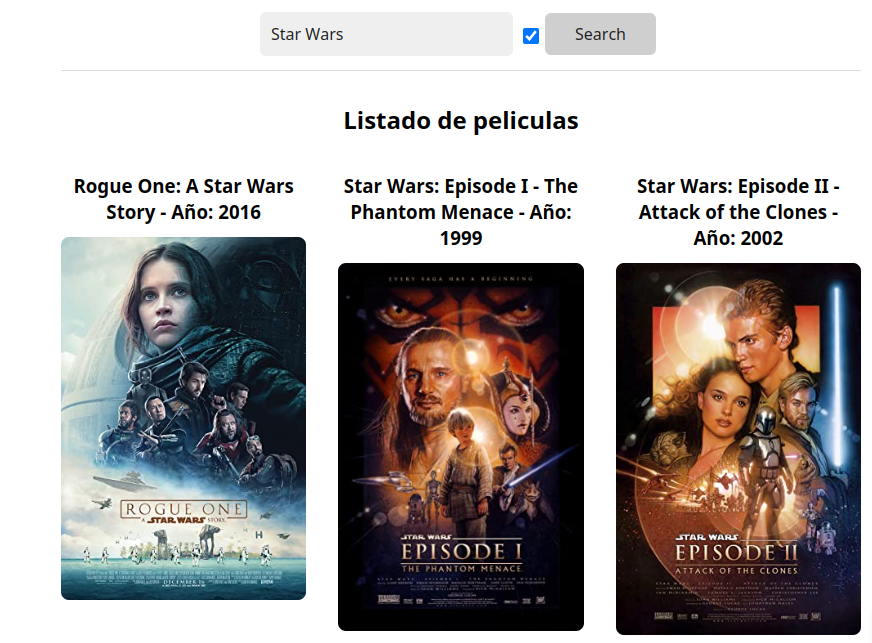

## Enunciado

Crea una aplicación para buscar películas

API a usar: - https://www.omdbapi.com/ Consigue la API Key en la propia página web registrando tu email.

## Requerimientos:

📌 Necesita mostrar un input para buscar la película y un botón para buscar.

📌 Lista las películas y muestra el título, año y poster.

📌 Que el formulario funcione

📌 Haz que las películas se muestren en un grid responsive.

📌 Hacer el fetching de datos a la API

## Primera iteración:

📌 Evitar que se haga la misma búsqueda dos veces seguidas.

📌 Haz que la búsqueda se haga automáticamente al escribir.

📌 Evita que se haga la búsqueda continuamente al escribir (debounce)